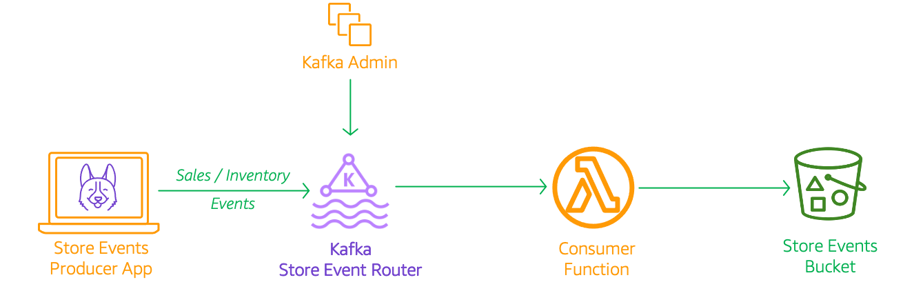
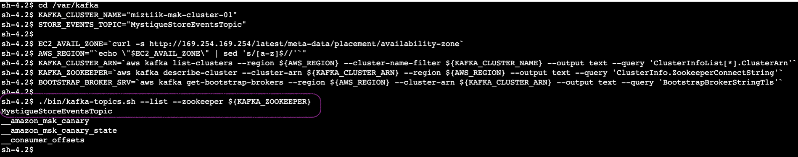
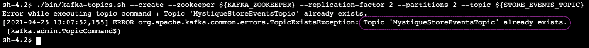
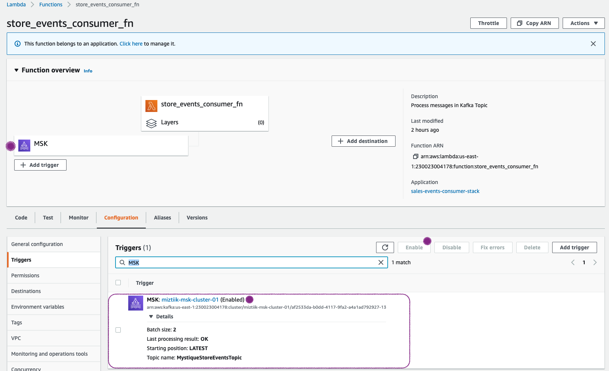
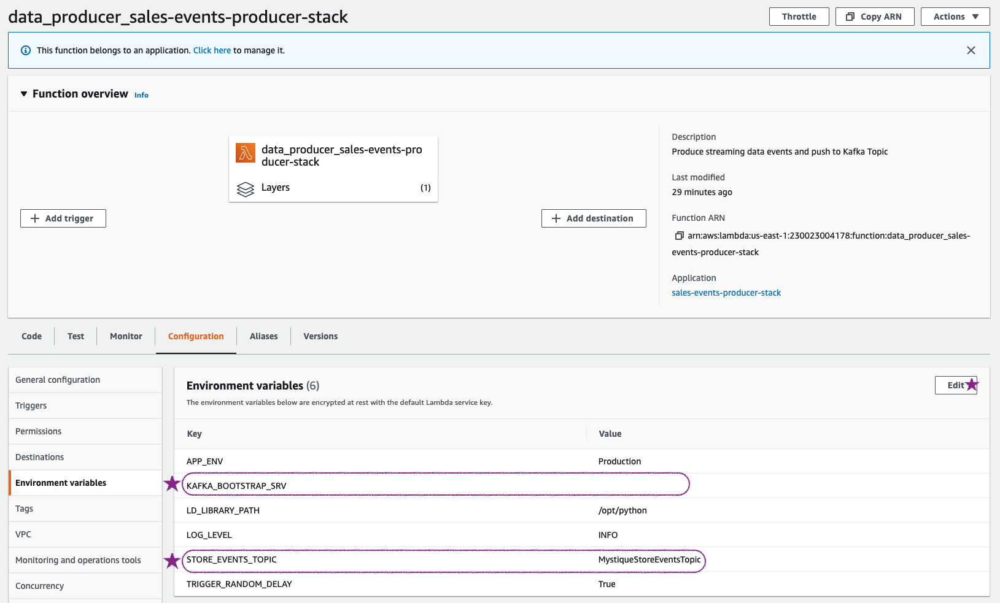
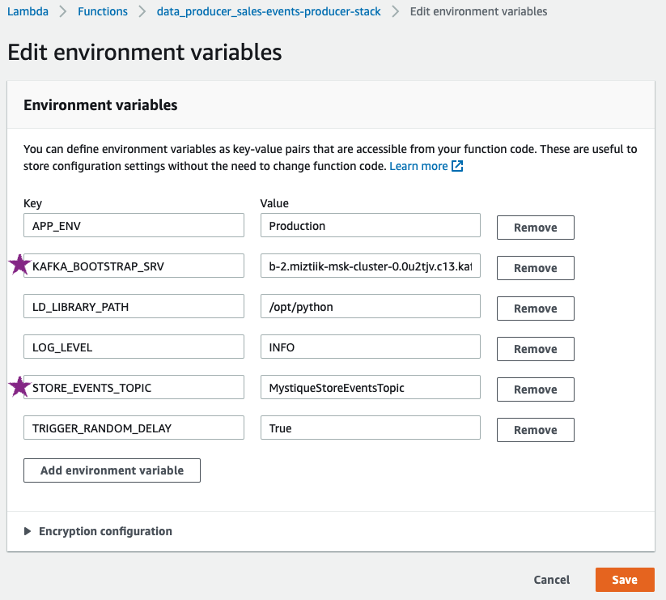
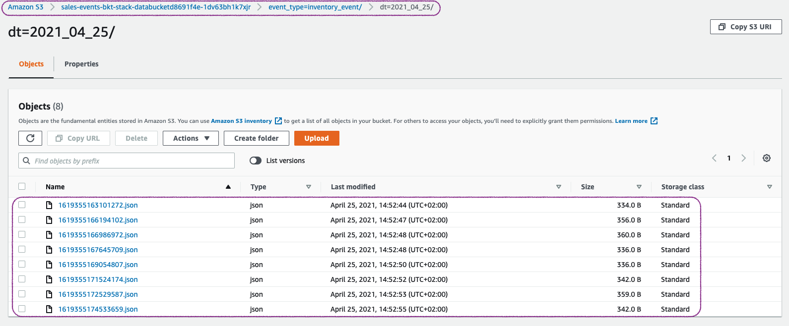

# Event Driven Architecture with Kafka

The developer at Mystique Unicorn are interested in building their application using event-driven architectural pattern to process streaming data. For those who are unfamiliar, _An event-driven architecture uses events to trigger and communicate between decoupled services and is common in modern applications built with microservices. An event is a change in state, or an update, like an item being placed in a shopping cart on an e-commerce website._

In this application, they will have their physical stores, send a stream _sales_ and _inventory_ related events to a central location, where multiple downstream systems will consume these events. For example, A event for a new order will be consumed by the warehouse system and the sales events will be used by the marketing department to generate revenue and forecast reports. This pattern of separating the produce, router and consumer to independent components allows them to scale the applications without constraints.

They heard that AWS offers capabilities to build event-driven architectures, Can you help them?

## 🎯 Solutions

Amazon MSK<sup>[1]</sup> is a fully managed service(for kafka) that makes it easy for you to build and run applications that use Apache Kafka to process streaming data. Apache Kafka is an open-source platform for building real-time streaming data pipelines and applications. With Amazon MSK, We can use native Apache Kafka APIs to populate data lakes, stream changes to and from databases, and power machine learning and analytics applications. The integration with AWS Lambda allows you to poll your Apache Kafka topic partitions for new records and invokes your Lambda function synchronously.

Let us consider a scenario, where a store is sending a stream of `sales` and `inventory` events that are to be consumed by two different personas. The sales managers and business analysts will need access to sales data to project revenue and create new marketing campaigns. The warehouse/delivery teams will need access to the inventory data to ensure the orders are dispatched to customer and restocked as needed. The event payload will look similar to this,

```json
{
  "request_id": "f5570d0f-5389-4bce-98c3-7ed5380eefb2",
  "event_type": "inventory_event",
  "store_id": 6,
  "cust_id": 206,
  "category": "Camera",
  "sku": 100657,
  "price": 2.52,
  "qty": 18,
  "discount": 8.2,
  "gift_wrap": true,
  "variant": "red",
  "priority_shipping": true,
  "ts": "2021-04-25T12:52:40.938937",
  "contact_me": "github.com/miztiik"
}
```



In this demo, we will create a the architecture like the one shown above. We will have a

- **Kafka Cluster**- Our primary events router with `2` brokers for high availability
  - The cluster is named `miztiik-msk-cluster-01`
- **producer** - Use a lambda function to creates sale events and ingests them to kafka topic
- **consumer** - A lambda function configured to be triggered by events in kafka topic and persist the events in S3
- **Kafka Admin** - An EC2 instance to administer the cluster - For ex. create kafka topics or modify topic attributes
  - An Kafka Topic named `MystiqueStoreEventsTopic`. Created using EC2 userdata script. The same is _hard coded_ as environment variables for the **producer** & **consumer** lambda functions
- **Data Bucket** - Persistent storage for the consumer

1.  ## 🧰 Prerequisites

    This demo, instructions, scripts and cloudformation template is designed to be run in `us-east-1`. With few modifications you can try it out in other regions as well(_Not covered here_).

    - 🛠 AWS CLI Installed & Configured - [Get help here](https://youtu.be/TPyyfmQte0U)
    - 🛠 AWS CDK Installed & Configured - [Get help here](https://www.youtube.com/watch?v=MKwxpszw0Rc)
    - 🛠 Python Packages, _Change the below commands to suit your OS, the following is written for amzn linux 2_
      - Python3 - `yum install -y python3`
      - Python Pip - `yum install -y python-pip`
      - Virtualenv - `pip3 install virtualenv`

1.  ## ⚙️ Setting up the environment

    - Get the application code

      ```bash
      git clone https://github.com/miztiik/event-streams-with-managed-kafka
      cd event-streams-with-managed-kafka
      ```

1.  ## 🚀 Prepare the dev environment to run AWS CDK

    We will use `cdk` to make our deployments easier. Lets go ahead and install the necessary components.

    ```bash
    # You should have npm pre-installed
    # If you DONT have cdk installed
    npm install -g aws-cdk

    # Make sure you in root directory
    python3 -m venv .venv
    source .venv/bin/activate
    pip3 install -r requirements.txt
    ```

    The very first time you deploy an AWS CDK app into an environment _(account/region)_, you’ll need to install a `bootstrap stack`, Otherwise just go ahead and deploy using `cdk deploy`.

    ```bash
    cdk bootstrap
    cdk ls
    # Follow on screen prompts
    ```

    You should see an output of the available stacks,

    ```bash
    sales-events-bkt-stack
    event-streams-with-managed-kafka-vpc-stack
    sales-events-kafka-stack
    kafka-admin-on-ec2-stack
    sales-events-producer-stack
    sales-events-consumer-stack
    ```

1.  ## 🚀 Deploying the application

    Let us walk through each of the stacks,

    - **Stack: sales-events-bkt-stack**

      This stack will create the s3 bucket. We will add a bucket policy to delegate all access management to be done by access points.

      Initiate the deployment with the following command,

      ```bash
      cdk deploy sales-events-bkt-stack
      ```

      After successfully deploying the stack, Check the `Outputs` section of the stack. You will find the `SalesEventsBucket`.

    - **Stack: sales-events-kafka-stack**
      As we are starting out a new cluster, we will use most default and choose `2` brokers for high availability. Each broker has about 1000GB of block storage attached to them. We need a VPC to host our kafka cluster, this dependency is resolved by using the vpc stack `event-streams-with-managed-kafka-vpc-stack`. The brokers will be launched in the private subnet. At this moment we are not configuring any authentication or encryption of data in our cluster.

      Initiate the deployment with the following command,

      ```bash
      cdk deploy event-streams-with-managed-kafka-vpc-stack
      cdk deploy sales-events-kafka-stack
      ```

      After successfully deploying the stack, Check the `Outputs` section of the stack. You will find the `SalesEventsKafkaRouter` cluster resource.

    - **Stack: kafka-admin-on-ec2-stack**

      To simulate the access of kafka admin, we use a simple ec2 instance that we can access. The EC2 instance will be launched in the public subnet along with a IAM Role that supports SSM Session Manager access<sup>[2]</sup>. This Ec2 instance IAM role also has permissions to interact _only_ with the cluster `SalesEventsKafkaRouter` created by the previous stack.

      Initiate the deployment with the following command,

      ```bash
      cdk deploy event-streams-with-managed-kafka-vpc-stack
      cdk deploy sales-events-kafka-stack
      ```

      After successfully deploying the stack, Check the `Outputs` section of the stack. You will find the Kafka Admin instance `KafkaAdminInstance` that we will later use for creating/listing topics

    - **Stack: sales-events-producer-stack**

      This stack will create the producer lambda function will generate a payload(_like the one shown above_). We need the kafka client libraries to ingest the payload to the kafka topic. This has been packaged as a _lambda layer_ along with the function. If you are interested take a look here `stacks/back_end/serverless_kafka_producer_stack/lambda_src/layer_code/`. The name of the topic and the broker server information are passed as environment variables to the lambda function. The lambda is designed to run for `10` seconds that will generate approximately about _13_ events per run.

      Initiate the deployment with the following command,

      ```bash
      cdk deploy sales-events-producer-stack
      ```

      After successfully deploying the stack, Check the `Outputs` section of the stack. You will find the `SaleOrderEventsProducer` resource.

    - **Stack: sales-events-consumer-stack**

      This stack will create a lambda consumer function. The function will be configured will a MSK Event trigger<sup>[3]</sup>.

      ```bash
      cdk deploy sales-events-consumer-stack
      ```

      After successfully deploying the stack, Check the `Outputs` section of the stack. You will find the `msgConsumer` resource.

1.  ## 🔬 Testing the solution

    1. **Connect To Ec2 Consumer**:

       Connect the `KafkaAdminInstance` instance using SSM Session Manager<sup>[3]</sup>. Navigate to `/var/kafka/` directory. Kafka has been preinstalled and _if_ user-data script had ran successfully, we should have a kafka topic created automatically for us. You can check the user data script status in logs on the instance at `/var/log/miztiik-automation-*.log`. The same log had been pushed to cloudwatch as well.

       Let us verify the kafka topic exists

       ```bash
        # Set the environment variables
        cd /var/kafka
        KAFKA_CLUSTER_NAME="miztiik-msk-cluster-01"
        STORE_EVENTS_TOPIC="MystiqueStoreEventsTopic"

        EC2_AVAIL_ZONE=`curl -s http://169.254.169.254/latest/meta-data/placement/availability-zone`
        AWS_REGION="`echo \"$EC2_AVAIL_ZONE\" | sed 's/[a-z]$//'`"
        KAFKA_CLUSTER_ARN=`aws kafka list-clusters --region ${AWS_REGION} --cluster-name-filter ${KAFKA_CLUSTER_NAME} --output text --query 'ClusterInfoList[*].ClusterArn'`
        KAFKA_ZOOKEEPER=`aws kafka describe-cluster --cluster-arn ${KAFKA_CLUSTER_ARN} --region ${AWS_REGION} --output text --query 'ClusterInfo.ZookeeperConnectString'`
        BOOTSTRAP_BROKER_SRV=`aws kafka get-bootstrap-brokers --region ${AWS_REGION} --cluster-arn ${KAFKA_CLUSTER_ARN} --output text --query 'BootstrapBrokerStringTls'`

        ./bin/kafka-topics.sh --list --zookeeper ${KAFKA_ZOOKEEPER}

       # Just incase, you want to create another topic, change the topic name and try this command
       ./bin/kafka-topics.sh --create --zookeeper ${KAFKA_ZOOKEEPER} --replication-factor 2 --partitions 2 --topic ${STORE_EVENTS_TOPIC}
       ```

       

       If you try to create the same topic again, you will get an error,
       

       At this point, we are almost set to use our kafka cluster.

    1. **Prepare Event Stream Consumer Lambda**:
       The event stream consumer `msgConsumer` is configured to be triggered by our kafka cluster. This is set up by cloudformation and sometime this trigger is `disabled` if the kafka cluster topic is unavailable or the cluster it not ready. Let us ensure our trigger is in `Enabled` state
       

       In case the topic is unavailable before this trigger was created, you _may_ see an error `Last processing result: **PROBLEM: Topic not found.**` like this. Try to disable to and re-enable the trigger.

       _If you have ensured the topic exists from `KafkaAdminInstance` and still the error persists, continue to the producer and invoke events. That should make the error go away._

    1. **Invoke Sale Order Events Producer**:
       Before invoking this function, let us ensure the environment variables for kafka topics and bootstrap server information is set correctly.
       

       You can grab the bootstrap server information from the `KafkaAdminInstance` or from **MSK Console** > **Clusters** > **`miztiik-msk-cluster-01`** > **View Client information** > **Bootstrap Servers**
       

       Let us invoke the lambda `SaleOrderEventsProducer` from the AWS Console. This function is designed to create both `sales_event` and `inventory_event` type events. If you want more events, invoke the function few times. Upon successful invocation you should a result like this,

       ```json
       {
         "resp": {
           "status": true,
           "tot_msgs": 13,
           "bad_msgs": 0,
           "sale_evnts": 5,
           "inventory_evnts": 8,
           "tot_sales": 633.8199999999999
         }
       }
       ```

    1. **Check S3 Data Bucket for Event**:

       Navigate to `SalesEventsBucket` in S3 Console, Here you can notice that the events are stored under two prefixes `sales_event` or `inventory_event`. As an example, here under the `inventory_event` prefix you will find the files received by our consumer function

       

       You can use S3 select to view the files.

1.  ## 📒 Conclusion

    Here we have demonstrated how to use kafka to route events between producers and consumers. You can extend this by using kafka's capability filter messages based on attributes. For example, the producer in this case is designed to produce some bad messages. You can write a rule to filter out the `bad_msgs` before sending them to consumers.

1.  ## 🧹 CleanUp

    If you want to destroy all the resources created by the stack, Execute the below command to delete the stack, or _you can delete the stack from console as well_

    - Resources created during [Deploying The Application](#-deploying-the-application)
    - Delete CloudWatch Lambda LogGroups
    - _Any other custom resources, you have created for this demo_

    ```bash
    # Delete from cdk
    cdk destroy

    # Follow any on-screen prompts

    # Delete the CF Stack, If you used cloudformation to deploy the stack.
    aws cloudformation delete-stack \
      --stack-name "MiztiikAutomationStack" \
      --region "${AWS_REGION}"
    ```

    This is not an exhaustive list, please carry out other necessary steps as maybe applicable to your needs.

## 📌 Who is using this

This repository aims to show how to use kafka as an event router to new developers, Solution Architects & Ops Engineers in AWS. Based on that knowledge these Udemy [course #1][102], [course #2][101] helps you build complete architecture in AWS.

### 💡 Help/Suggestions or 🐛 Bugs

Thank you for your interest in contributing to our project. Whether it is a bug report, new feature, correction, or additional documentation or solutions, we greatly value feedback and contributions from our community. [Start here](/issues)

### 👋 Buy me a coffee

[](https://ko-fi.com/Q5Q41QDGK) Buy me a [coffee ☕][900].

### 📚 References

1. [AWS Docs: Amazon MSK][1]
1. [AWS SSM Session Manager][2]
1. [AWS Docs: Amazon MSK cluster as an event source][3]
1. [AWS Docs: Create Topics][4]
1. [Docs: Troubleshooting Your Amazon MSK Cluster][5]

### 🏷️ Metadata


**Level**: 200

[1]: https://aws.amazon.com/msk/
[2]: https://www.youtube.com/watch?v=-ASMtZBrx-k
[3]: https://docs.aws.amazon.com/lambda/latest/dg/services-msk-topic-add.html
[4]: https://docs.aws.amazon.com/msk/latest/developerguide/create-topic.html
[5]: https://docs.aws.amazon.com/msk/latest/developerguide/troubleshooting.html#networking-trouble
[100]: https://www.udemy.com/course/aws-cloud-security/?referralCode=B7F1B6C78B45ADAF77A9
[101]: https://www.udemy.com/course/aws-cloud-security-proactive-way/?referralCode=71DC542AD4481309A441
[102]: https://www.udemy.com/course/aws-cloud-development-kit-from-beginner-to-professional/?referralCode=E15D7FB64E417C547579
[103]: https://www.udemy.com/course/aws-cloudformation-basics?referralCode=93AD3B1530BC871093D6
[899]: https://www.udemy.com/user/n-kumar/
[900]: https://ko-fi.com/miztiik
[901]: https://ko-fi.com/Q5Q41QDGK
